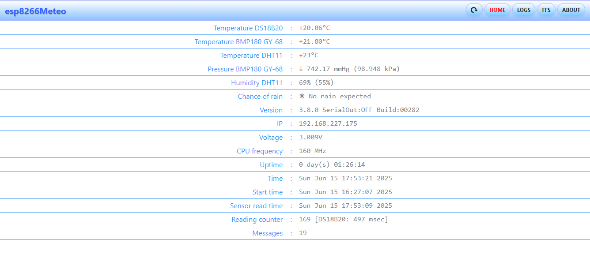

# 🌤️ esp8266Meteo — ESP8266-Based Wi-Fi Weather Station with Telegram and Web UI

A PlatformIO-based ESP8266 project for collecting weather data, featuring a Telegram bot and a responsive web interface.

## 🚀 Features

- ESP8266 support (NodeMCU, Wemos D1 Mini, etc.)
- Telegram bot interaction using `UniversalTelegramBot`
- Lightweight HTTP server via `ESP Async WebServer`
- Sensor support:
  - DS18B20 (1-Wire temperature)
  - DHT11 (humidity & temperature)
  - BMP180 (GY-68, barometric pressure)
- Wi-Fi connectivity with auto-reconnect
- LED status indication (GPIO control)
- LittleFS for serving compressed frontend assets

## 📁 File Structure

```
esp8266Meteo/
├── platformio.ini
├── src/
│   ├── esp8266Meteo.cpp
│   ├── esp8266Meteo.h
│   └── secret.h
├── lib/
│   ├── TrendTracker/         # TrendTracker detects trends in float data using linear regression with a ring buffer.
│   │   └── src/
│   │       ├── TrendTracker.h
│   │       └── TrendTracker.c
│   └── UniversalTelegramBot/ # Included UniversalTelegramBot by Brian Lough
│       ├── src/
│       │   ├── TelegramCertificate.h
│       │   ├── UniversalTelegramBot.h
│       │   └── UniversalTelegramBot.cpp
│       ├── LICENSE.md
│       └── README.md
├── data/                     # Gzipped web files served by ESP8266 (LittleFS)
│   ├── ajax.js.gz
│   ├── bs.010.css.gz
│   ├── bs.025.css.gz
│   ├── index.html.gz
│   ├── index_body.html.gz
│   ├── script.js.gz
│   ├── styles.css.gz
│   ├── u.01.css.gz
│   ├── u.02.css.gz
│   ├── reload.png
│   ├── loader.gif
│   ├── thresholds.dat
│   └── icon.png
├── flashFS.src/              # Uncompressed sources for web UI (manually compressed via Perl script)
│   ├── prepareDataLinux.pl   # Linux perl-script to compress and copy to /data
│   ├── prepareDataWin.pl     # Windows perl-script to compress and copy to /data
│   ├── ajax.js
│   ├── bs.010.css
│   ├── bs.025.css
│   ├── index.html
│   ├── index_body.html
│   ├── script.js
│   ├── styles.css
│   ├── u.01.css
│   ├── u.02.css
│   ├── reload.png
│   ├── loader.gif
│   ├── thresholds.dat
│   └── icon.png
└── README.md            # This file
```

## 📸 Screenshots Web UI

### Main page


### Logs page


### Flash file system page


## 🛠 Requirements

- [PlatformIO](https://platformio.org/)
- ESP8266 Board Platform (installed via PlatformIO)
- Required libraries:
  - `ESP8266WiFi`
  - `WiFiClientSecure`
  - `UniversalTelegramBot`
  - `ESP8266WebServer`
  - `DallasTemperature`
  - `OneWire`
  - `Adafruit_BMP085`
  - `DFRobot_DHT11`
  - `FS` / `LittleFS`

- [UniversalTelegramBot Library Docs](https://github.com/witnessmenow/Universal-Arduino-Telegram-Bot)
- [ESP8266 LittleFS Docs](https://arduino-esp8266.readthedocs.io/en/latest/filesystem.html)


## ⚙️ Setup

1. Open the file `esp8266Meteo/platformio.ini` in PlatformIO
2. Configure the upload port in `platformio.ini`:
   ```ini
      upload_port = <YourPort>  ; Example: COM3 or 192.168.x.x for OTA
   ```
3. Replace the file `esp8266Meteo/src/esp8266Meteo.h` with your data:
   ```cpp
    #define TIMEZONE_OFFSET      3 // Set your time zone offset. For example: Europe/Moscow (UTC+3) -> offset = 3
    #define NTP_SERVER          "pool.ntp.org" // Set the closest available NTP server for time synchronization
   // Set thresholds for TrendTracker to filter out minor fluctuations and detect clear trends. 
   // You can adjust them in the file flashFS.src/thresholds.dat.
    #define TEMPERATURE_THRESHOLD 0.05f
    #define PRESSURE_THRESHOLD    0.05f
    #define HUMIDITY_THRESHOLD    0.06f
   ```
4. Replace the file `esp8266Meteo/src/secret.h` with your data:
   ```cpp
    #define SSID "YourWiFi"
    #define PASSWORD "YourPassword"
    #define BOT_TOKEN "YourTelegramBotToken"              // Telegram BOT Token (Get from Botfather)
    #define LATITUDE latitude_of_your_weather_station     // For example 51.500833
    #define LONGITUDE longitude_of_your_weather_station   // For example -0.124444
   ```
5. Upload the firmware to the board:
   ```bash
    pio run --target upload
   ```
6. Use `flashFS.src/prepareDataLinux.pl` or `flashFS.src/prepareDataWin.pl`
to compress `.html`, `.js`, and `.css` files into `.gz` format (if needed — the `data/`
folder may already contain pre-compressed files) and automatically copy them into the `/data/`
directory for uploading to LittleFS.

7. Upload the frontend assets to LittleFS:
   ```bash
    pio run --target uploadfs
   ```

## 🌐 Usage

- Open the web interface in a browser: http://<device_ip>/
- Use the following Telegram bot commands:
   ```bash
    /info
    /meteo
    /location
   ```
- Monitor system status via onboard LEDs (e.g., for Wi-Fi, sensor states, or error codes)

## 🔒 Security Notes

- The Telegram bot uses polling; no webhook is required.
- Keep your bot token and Wi-Fi credentials secure inside `secret.h`.
- OTA support is available and can be password-protected (see ArduinoOTA options).

## 📄 License

MIT License.

This project includes the UniversalTelegramBot library by Brian Lough (MIT License),
located in `lib/UniversalTelegramBot/`.

Full license text is provided in lib/UniversalTelegramBot/LICENSE.md.

## 👤 Author

[RSnakin](https://github.com/rsnakin)
